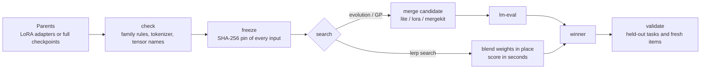

<div align="center">

# Lerp

**Find the right blend of language models — seconds per candidate, every claim auditable.**


[English](README.md) · [한국어](README.ko.md) · [Reference manual](docs/REFERENCE.md) · [Measured results](experiments/RESULTS.md) · [Ecosystem map](ECOSYSTEM.md)

</div>

Lerp blends fine-tuned models that share a base — **LoRA adapters or full checkpoints, dense, multimodal or mixture-of-experts** — and searches for the blend weights
per module group (attention, MLP, router, ...). `W = W0 + w · Δ` is a linear interpolation, hence the name. It does **not** train new models from scratch,
and a successful merge does not imply a better model: Lerp's job is to find good blends cheaply and to prove (or disprove) that they are better.

## Why Lerp

- **Seconds per candidate.** `lerp search` keeps one model on the accelerator, writes each blend into it in place and scores the items itself, for LoRA pairs and for full checkpoints (including mixture-of-experts):
  4 s per candidate for a 0.5B model, 29 s for Qwen3-4B, 44 s for the 6.9B-parameter OLMoE (the same step took ~285 s, ~11-14 min and ~10 min through a fresh `lm-eval` run per candidate).
- **Sample-efficient search.** Gaussian-process Bayesian search (`search: gp`) reached the same blend quality as evolution with a third of the evaluations; evolution and Pareto selection remain available when you want specialists.
- **One pipeline across model families and benchmarks.** A single rule table maps tensors to module groups; mixture-of-experts routers and experts, multimodal towers and unfamiliar architectures are handled by configuration (`tensor_rules`), and any log-likelihood multiple-choice benchmark is a `task:` block in the YAML, not code.
- **Auditable.** Inputs and outputs are SHA-256 pinned, winners are re-scored on items the search never saw, simulated scores cannot leak into real results, and the docs list what is *not* verified.

## How it works



## Quick start

```bash
pip install "lerp[lora,gp,eval] @ git+https://github.com/spear34000/Lerp"
lerp --version

# No-download demo with fake scores (never reported as real results)
lerp init -c examples/multi_parent_demo.yaml -o runs/toy
lerp simulate -r runs/toy && lerp advance -r runs/toy --allow-simulated && lerp report -r runs/toy
```

Two LoRA adapters trained on the same base, searched with GP and validated:

```bash
cp examples/gp_demo.yaml my.yaml            # point base_model and parents at your adapters
lerp check  -c my.yaml                      # family rules, tokenizer, tensor names
lerp init   -c my.yaml -o runs/my && lerp freeze -r runs/my --strict
lerp cycle  -r runs/my --rounds 3 --engine lora      # search: gp  ->  3 + 3 + 3 evaluations
lerp validate -r runs/my -c examples/holdout_evaluation.yaml --baseline all

# Or search in seconds per candidate: one resident model, blends written in place (LoRA or full checkpoints)
lerp search -r runs/my --rounds 6 --baselines --device xpu      # scores land in the same run folder
lerp build  -r runs/my -g 5 -i 0 --engine lora                # materialise only the winner, then validate it
```

Windows: set `PYTHONUTF8=1`. More in the [reference manual](docs/REFERENCE.md).

## What has been measured

Small models on one 16 GB Intel Arc machine; sample sizes are 100-300 items per task, so differences below ~0.05 are noise. Full tables, seeds and caveats are in [`experiments/RESULTS.md`](experiments/RESULTS.md).

| Question | Result |
|---|---|
| How fast is `lerp search`? | Qwen2.5-0.5B: 285 s → 4 s per candidate. Qwen3-4B: 11-14 min → 29 s. OLMoE-1B-7B (64 experts per layer, full checkpoints): ~10 min → 44 s. Scores match `lm-eval` within 1-3 items per 100 (bf16 rounding depends on batch composition) |
| Does merging help? | **Only when the skills are complementary.** An ARC LoRA + a BoolQ LoRA (Qwen2.5-0.5B) blend to 0.78 on fresh items against 0.71 / 0.69 for the parents (+0.07, about 3 standard errors). Weak or redundant pairs gave no detectable gain over the better parent |
| GP vs evolution? | 8 GP evaluations found blends as good as 24 evolution evaluations (fresh-item fitness 0.739 vs 0.741). Evolution did **not** beat plain random search |
| GP vs random? | Indistinguishable when the weight landscape is a wide plateau (30 evaluations, 300 items). The speed-up comes from the evaluation loop, not from a smarter optimizer |
| Large and unusual checkpoints | Gemma 4 E4B (multimodal, 16 GB): merged in 5 min, arithmetic verified, generates. OLMoE-1B-7B (64 experts per layer): 3,219 tensors, 12.9 GiB in 55 s, each module group matches its weight to 2e-3, scored between its parents |
| Different families (Qwen3 + Gemma 4) | Cannot be weight-merged; `check` refuses with architecture, vocabulary, tokenizer and tensor-name mismatches |

## Models verified so far

| Family | Kind | What was run |
|---|---|---|
| Qwen2.5-0.5B | dense | LoRA training and merging, full-checkpoint merging, evolution, GP |
| Qwen3-4B (Base, post-trained) | dense | LoRA training and merging, full-checkpoint merging, GP, resident loop |
| Gemma 4 E4B (pt, it) | multimodal | full-checkpoint merge and generation |
| OLMoE-1B-7B (base, Instruct) | mixture-of-experts | full-checkpoint merge, generation, evaluation |
| Gemma-4-26B-A4B, Qwen3-30B-A3B | MoE | LoRA targets and tensor groups probed from the config only; **not merged** |

## What is supported, and what is not

| Supported | Notes |
|---|---|
| Linear and task-arithmetic merging | full checkpoints (`lite` engine, or MergeKit) and LoRA adapters (exact rank concatenation) |
| SLERP, TIES, DARE-TIES, DARE-linear | full checkpoints only, own implementation in the `lite` engine and `lerp search` (identical numbers in both, DARE seeded); not bit-identical to MergeKit, quality not yet measured against linear (see RESULTS.md) |
| Layer-wise and module-group-wise weights | attention / mlp / router / norm / embedding / other, plus a depth profile; routers of MoE models are their own group |
| Search | evolution, GP + expected improvement, random; `lerp search` scores in seconds with a resident model |
| Evaluation | log-likelihood multiple-choice and greedy-decoded exact-match tasks as YAML blocks; any lm-eval task through `lerp cycle` |

| Not supported (today) | What happens instead |
|---|---|
| Training from the CLI | no `lerp train`; LoRA training is the script `experiments/train_lora.py` |
| DoRA, AdaLoRA, rsLoRA-patterns, bias / `modules_to_save`, `rank_pattern`, embedding LoRA | the adapter is rejected with an error (`check`, `build`) |
| Quantized inputs (GPTQ, AWQ, GGUF, bitsandbytes bases / QLoRA bases) | dequantize first; the merge needs the full-precision base |
| Changing architecture (layer removal, width change, Dense <-> MoE conversion) | not implemented; parents must share exactly the same architecture |
| Knowledge editing (ROME, MEMIT) | out of scope |
| Different families (Qwen3 + Gemma 4) | cannot be weight-merged; `check` refuses |

## Limits worth knowing

- Ancestry cannot be proven from files: matching configs and shapes do not show that two checkpoints share a base revision.
- Merged checkpoints larger than ~14 GB cannot be evaluated on a 16 GB GPU without quantization (no GGUF backend yet). Merging itself streams tensor by tensor.
- `lerp search` scores log-likelihood multiple-choice tasks (`acc`, `acc_norm`) and greedy-decoded generative tasks (`exact_match`, e.g. GSM8K); code execution (HumanEval, MBPP) is not supported. It refuses models whose logits it cannot reproduce (checked on startup) and checkpoints whose tensor names it cannot map onto the loaded model.
- Measured gains are small and mostly within noise except for one complementary pair; see the table above and [`experiments/RESULTS.md`](experiments/RESULTS.md).
- Read the [critical review](docs/CRITICAL_REVIEW_KO.md) and the [technical audit](docs/V04_TECHNICAL_AUDIT.md) before quoting any result.

## Repository

```
lerp/          package: spec, declarative tasks, family rules, lite / lora engines, resident search, GP, integrity, CLI
examples/      demo configs (LoRA, GP, declarative tasks), PEFT smoke tests
experiments/   training, verification and search scripts + RESULTS.md with every table
docs/          reference manual, architecture, audits
tests/         150+ tests (numerical merge checks, crash recovery, GP, model families, resident search against the merge engines)
```

## Roadmap

Planned, in order: paired statistics against the parents (McNemar), a measured skill-adapter demo (code / math / Korean LoRA at 4B),
a profiled and faster candidate apply. Considered but not started: a `lerp train` command, a GGUF / llama.cpp evaluation backend, layer removal before merging.
Out of scope: Dense <-> MoE conversion, dimension expansion, knowledge editing, custom GPU kernels.

## License

Apache-2.0 (see [LICENSE](LICENSE)). Lerp grew out of ModelBreeder v0.4 (MIT); its notice is kept in [NOTICE](NOTICE). The old `modelbreeder` command still works as an alias.
