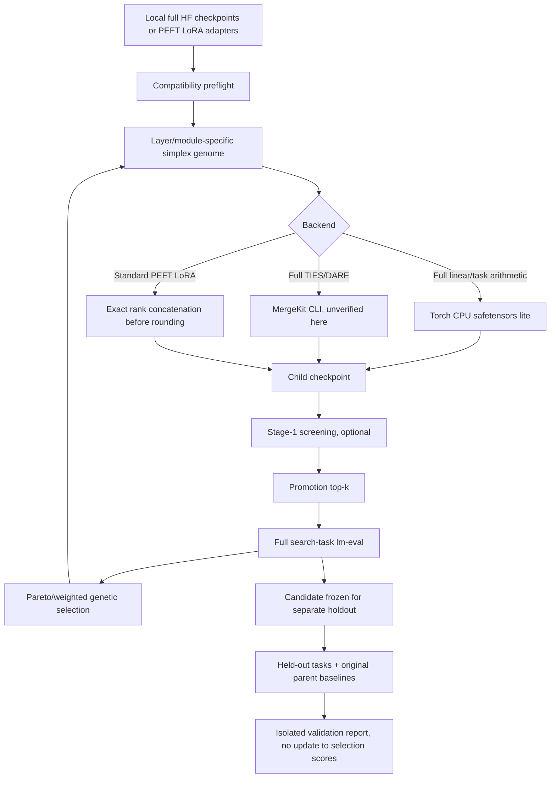

# Lerp v0.5 — Architecture and trust boundaries

## What is bred?

The genetic algorithm searches over coefficients for existing parent models and can choose among listed merge methods. It **does not** fine-tune parameters by gradient descent or breed each generation's output checkpoints recursively. This limits experiment complexity and prevents cumulative error in the input checkpoint lineage.

A two-parent genome has one alpha value per interpolation control point (second parent weight `1-alpha`). Three or more parents use a per-layer, per-module-family simplex whose columns sum to 1, interpolated across model depth. Global/nonlayer tensors use the mean across control points in lite; unexpected tensor names fall back to group `other`.

## PEFT LoRA math

The update is `delta_i = alpha_i/r_i * B_i @ A_i` (or `/sqrt(r_i)` for rsLoRA). Each candidate converts each source `B_i` into `B_i * coefficient_i * scale_i`, concatenates all `B_i` on the rank axis and all `A_i` on the rank axis, and writes a new adapter with `r_out=sum(r_i)` and `alpha_out=r_out` so its runtime PEFT scale equals 1. Numerical equivalence is tested on fake small tensors. Output floating-point conversion introduces quantization error; the claim is **not bit-for-bit exact for fp16/bf16**.

No DoRA, bias updates, embedding LoRA, modules_to_save, non-uniform ranks by layer, unusual LoRA variants, or mixed tensor keys. All unsupported cases fail closed.

## Scoring/selection

- Stage1 `screen_score.json` is always preliminary and never enters final leaderboard.
- Stage2 `score.json` is extracted from `lm-eval` result JSON under `evaluation/` with recorded task/settings metadata and evidence path.
- A candidate's scalar fitness is normalized weighted mean (task metric must be between 0 and 1) minus an optional maximum-minus-minimum gap penalty.
- NSGA-II-inspired nondominated fronts and crowding-distance encourage specialist tradeoffs; **not statistically uncertainty-aware**. Evaluation task names must match exact lm-eval output keys.
- Optional `validate` uses separate tasks, freezes config by hash and writes scores separately under `validation/`. Matching task names are rejected, yet benchmark instance/label overlap and train leakage are NOT detected.

## Durability/security

`state.json` (schema 3) holds current generation and a config hash. New generations are prepared in `.gen-NNN.partial` before atomic rename; they contain a commit marker so a state update crash can be recovered. A candidate merge writes only to `.model.partial` and succeeds only if output artifacts exist. Evaluator saves to `.evaluation.partial` / `.screening.partial`; crashes leave discoverable artifacts and require explicit `--retry-partial` except fully completed evaluation recovery. Local input references may be content-pinned via SHA-256 (`freeze --strict`); merged checkpoint files are hashed before final publication and reverified before evaluation. CLI mutators hold an OS-backed per-run write lock; library callers still need their own synchronization.

## Unverified external boundaries

- Actual `peft.PeftModel.from_pretrained()` load of generated adapter on real Transformers architecture
- Real `mergekit-yaml` full merge, real `lm-eval` execution and quality metrics
- Cross-driver/OS/device performance, memory pressure and GPU behavior
- Model licenses, provenance/revision integrity, duplicate dataset filtering and statistical significance

These are validation gates, not claims that the program passed them.

## v0.4 trust and measurement additions

1. `freeze` snapshots exact local model file bytes before any score. `verify-inputs` will reject changed content or config. Remote model references are flagged as unverified and blocked in strict mode.
2. Built children get a separate `modelbreeder_artifact_integrity.json`; evaluator refuses modified checkpoint files.
3. LoRA concatenation enforces configured output rank and tensor-byte estimates based on safetensors header shapes. These are not GPU/CPU peak RAM guarantees.
4. `modelbreeder_protocol.json` stores the execution command and actual runtime device. Comparisons only operate on matching recorded protocol settings.
5. `compare-samples` implements exploratory paired bootstrap CI from identical sample IDs; `audit-splits` catches normalized text/ID overlap. Neither replaces a genuinely untouched heldout set.
6. CLI mutators lock the experiment with advisory operating-system locks; direct Python entrypoints are not wrapped.

Unresolved: actual PEFT load in this environment, external lm-eval/MergeKit integration, trusted model commit provenance, low-rank compression, semantic deduplication, robust research statistics across multiple candidate selection rounds.
